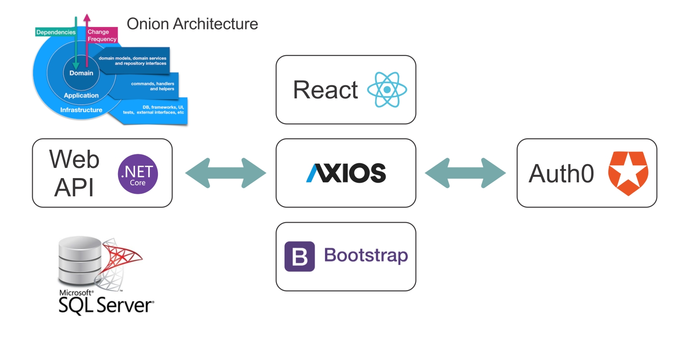
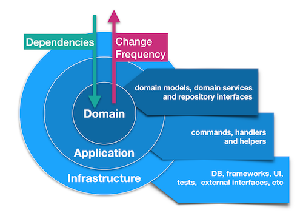
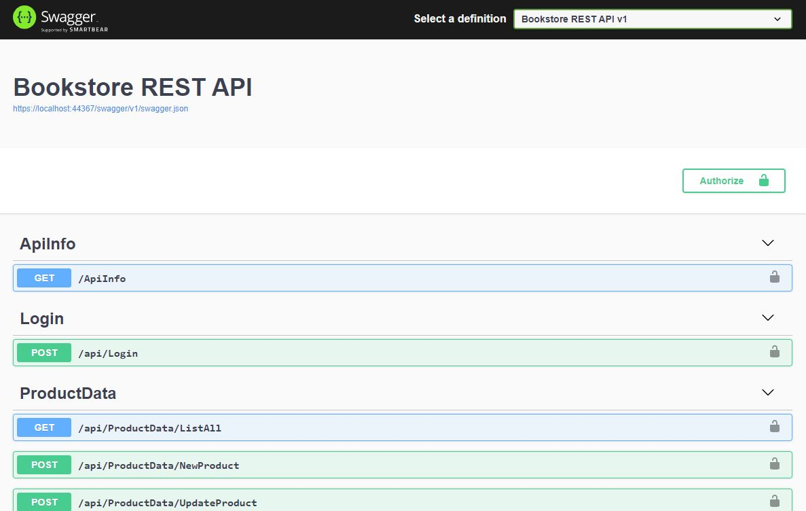
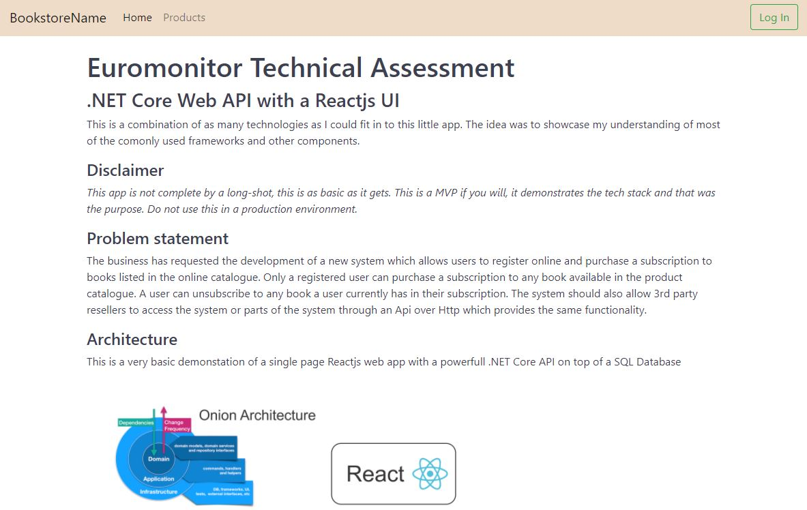
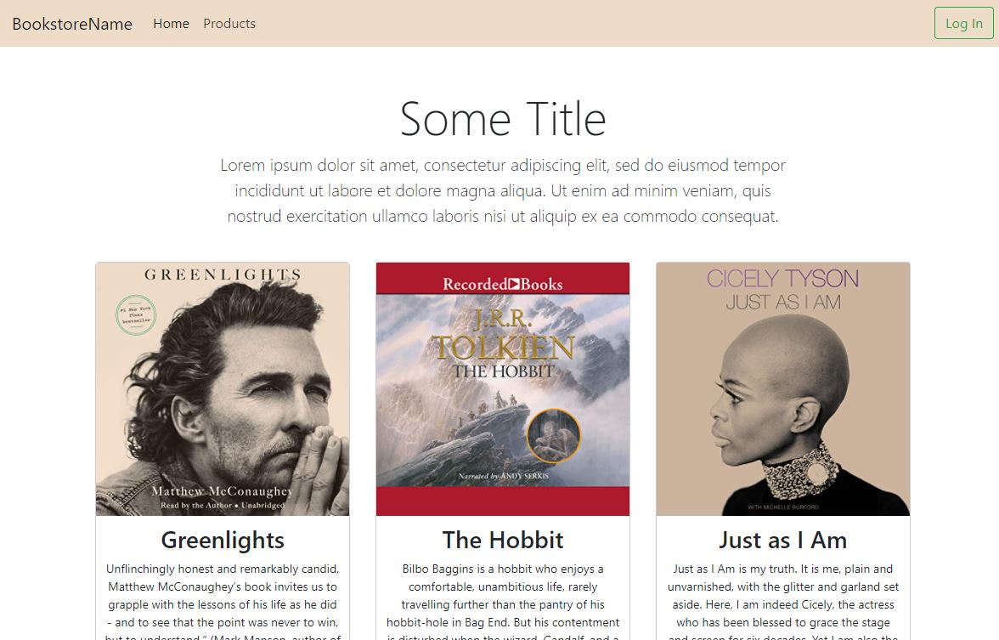
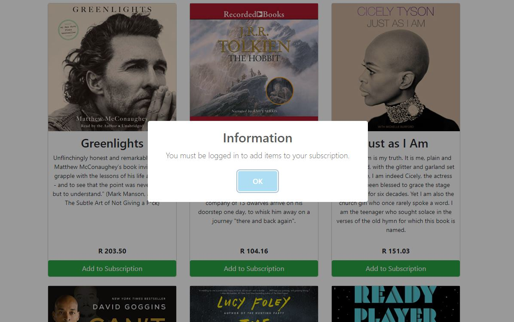
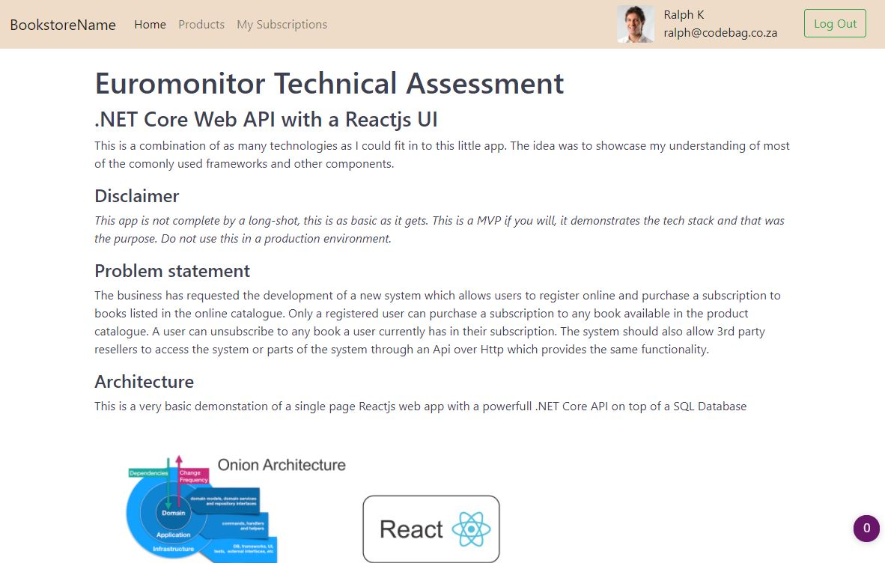
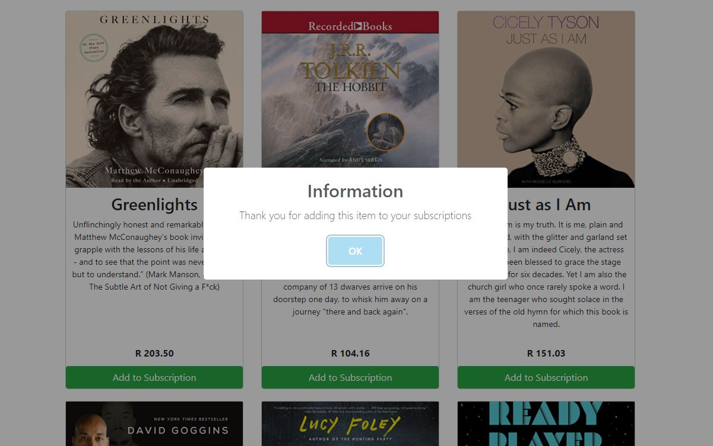
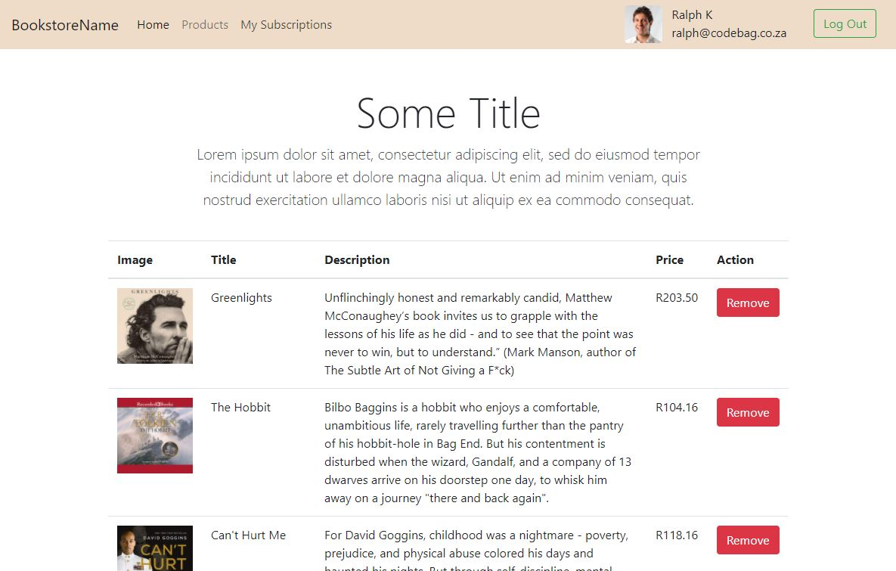

# Technical Assessment

### .NET Core Web API with a Reactjs UI

This is a combination of as many technologies as I could fit in to this little app. The idea was to showcase my understanding of most of the comonly used frameworks and other components.

#### Disclaimer

_This app is not complete by a long-shot, this is as basic as it gets. This is a MVP if you will, it demonstrates the tech stack and that was the purpose. Do not use this in a production environment._

#### Problem statement

The business has requested the development of a new system which allows users to register online and purchase a subscription to books listed in the online catalogue. Only a registered user can purchase a subscription to any book available in the product catalogue. A user can unsubscribe to any book a user currently has in their subscription. The system should also allow 3rd party resellers to access the system or parts of the system through an Api over Http which provides the same functionality.

#### Repo URLs

Front-End Application: [https://github.com/Ralph-Codebin/BookstoreFrontEnd](https://github.com/Ralph-Codebin/BookstoreFrontEnd)

Back-End Application: [https://github.com/Ralph-Codebin/BookstoreApi](https://github.com/Ralph-Codebin/BookstoreApi)

#### Architecture

This is a very basic demonstation of a single page Reactjs web app with a powerfull .NET Core API on top of a SQL Database

### Frontend Stack

The frontend consists mainly of a single page Reactjs application, it utilizes [Axios](https://www.npmjs.com/package/axios) to do the api calls to the .NET core backend.

*   React
*   React Dom
*   React Scripts
*   Auth0
*   Axios
*   Bootstrap
*   SweetAlert2

### Backend Stack

The backend is a .NET Core 3.1 Web API with SQL as the database. I also decided to make use of dependency injection and to showcase some of the STANDARDS we should all try to use more often in our development.

*   .NET Core 3.1
*   C#
*   Swagger
*   Automapper
*   Mediatr
*   Entity Framework
*   Serilog
*   MS SQL
*   Fluent Validation

### Onion Architecture

Onion Architecture is comprised of multiple concentric layers interfacing each other towards the core that represents the domain. The architecture does not depend on the data layer as in classic multi-tier architectures, but on the actual domain models.

*   The application was architected around the clean/onion architecture style.
*   The Domain and Application form the Application Core.
*   All other dependencies face inward toward the Core.
*   The Core should never depend on concrete implementations of UI or Infrastructure, but should rather depend on interfaces.

### Special Case Pattern

*   A modified version of the Special Case pattern mingled in with the Map-Reduce Pattern is used as a ResultMarshal.
*   This allows the return of different result types (ie entity created vs validation errors), while encapsulating these types as a single result.
*   The caller does not need to know any internal details about the implementing method and can map decisions based on the Special Case class types without ever having to check for nulls.

### Unit of Work pattern

*   The Unit of Work pattern was implemented using the Microsoft.EntityFrameworkCore.UnitOfWork library.
*   This library allows dynamic resolution of repositories through the IUnitOfWork.GetRepository interface.

### Dependency Injection

*   The standard, built-in Microsoft Dependency Injection framework was used.

### Bearer Token Authentication

*   Endpoints are protected through Bearer Token authentication.
*   So long as the JwtTokenConfiguration.SecurityKey in appsettings.json setting is replicated to all load balancers, the token will be correctly authenticated on all nodes.
*   To acquire a token, an application needs to POST a form to the login controller that contains an authenticated Username and Password.

### Automapper

*   For simple property mapping Automapper was used.

### OpenAPI/Swagger

*   The REST API is documented using the Swashbuckle toolkit that supports the OpenAPI spec.

### Serilog

*   The Serilog Debug sink was used to write information out to a Log table in the database.

### Entity Framework

*   Entity Framework Core was chosen as the ORM for this implementation

### Immutable Value Objects

*   reat care was taken to ensure that Value Objects are immutable once constructed. The best way to achieve this was through hydrating internal properties by means of a Json serialiser.
*   Mapping ValueObject Properties on Entities is done through the EntityFrameworkExtensions class' ValueObject extension method.

### MediatR

*   Mediation between Presentation and Application is handled with the MediatR library.
*   The Handlers exist to encapsulate use-cases.

### MediatR

*   Mediation between Presentation and Application is handled with the MediatR library.
*   The Handlers exist to encapsulate use-cases.

### FluentValidation

*   Domain Validation is handled using the Fluent Validation framework.
*   Minimal API Model validation is used as this would duplicate domain knowledge. Most inputs are therefore assumed to be valid until a Domain Validator says otherwise.

### Currently Out of Scope

*   Unit Tests are at incomplete and in a real-world solution it is a must.

### Setup Requirements

To get this solution to run, a few steps need to be taken

*   Installing Nodejs will make thins go smoother than not having it.
*   In the project there is a folder calles resources: _BookstoreAPI > Repository.EntityFramework > Resources_. In here are the scripts that need to be run to create the sql database.
    *   1\. Database.sql
    *   2\. Tables.sql
    *   3\. SeedData.sql
*   You have to create an account on [Auth0.com](https://auth0.com/), its free and once you use it you will wonder how you ever managed withou it.
*   In the root folder of the React project there is a .env file that you have to update with the tokens you will get from Auth0

#### Demo
When the app loads for the first time only the [Home] and [Products] menu items are available along with a [Log In] button

At this stage the products are visible to all users.

When a unauthenticated user tries to add an item to subscriptions a Swal message is displayd prompting them to log in.

When logged in the [My suvscriptions] menu item is available along with a thumbnail (if they used google to log in) and some personal info.

When the user now clicks the add to subscriptions button, they will get a confirmation that the item has been added.

On the subscriptions page the user will be able to view the items in their subscription and also has the ability to remove items from said subscription.

#### Conclusion

If you have read this far then thank you, I gave up a weekend to make this little demonstration and I appreciate that you took the time to read it.

Please let me know if you have any suggestions or questions.

Regards

Ralph Kleinschmidt

https://www.linkedin.com/in/rkleins/
